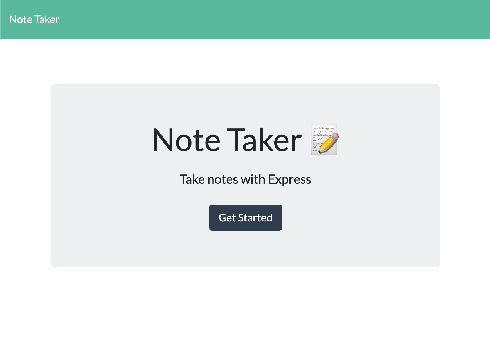

# Note Taker App

## Table of Contents:

- [Description](#description)
- [Usage](#usage)
- [Installation](#installation)
- [Link to Deployed Application](#link-to-deployed-application)
- [Link to GitHub Repo](#link-to-github-repo)
- [Screenshots](#screenshots)
- [Questions](#questions)

## Description

The purpose of this application is to provide a database for the user to store personal notes.

## Usage

The user can write and save notes for personal use. The notes can be viewed again at any time by navigating to the app URL and clicking on the title of the desired note. The user can delete a note by clicking the trashcan button, which deletes the note from the database.

## Installation

Visit the deployed application URL.

## Link to Deployed Application

https://note-taker118.herokuapp.com/

## Link to GitHub Repo

https://github.com/mfandel118/Note-Taker

## Screenshot(s)

## Questions

Any additional questions about this project? Please feel free to reach out:

Marissa Fandel

- Email: mfandel118@gmail.com
- GitHub: https://github.com/mfandel118
